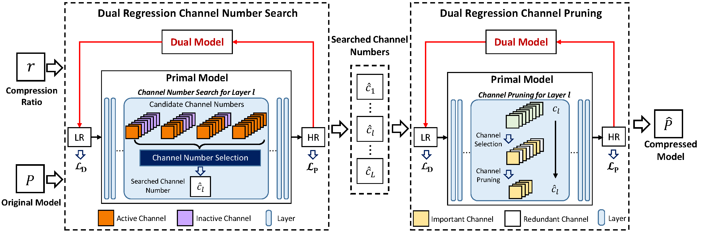
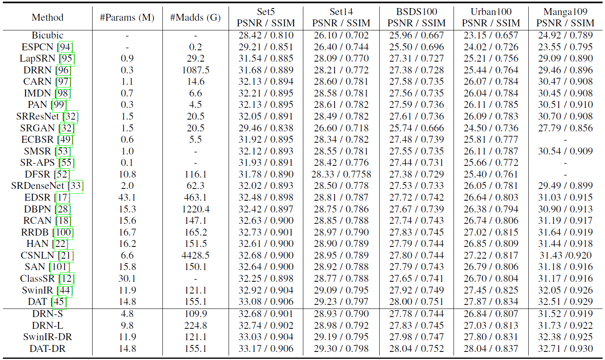
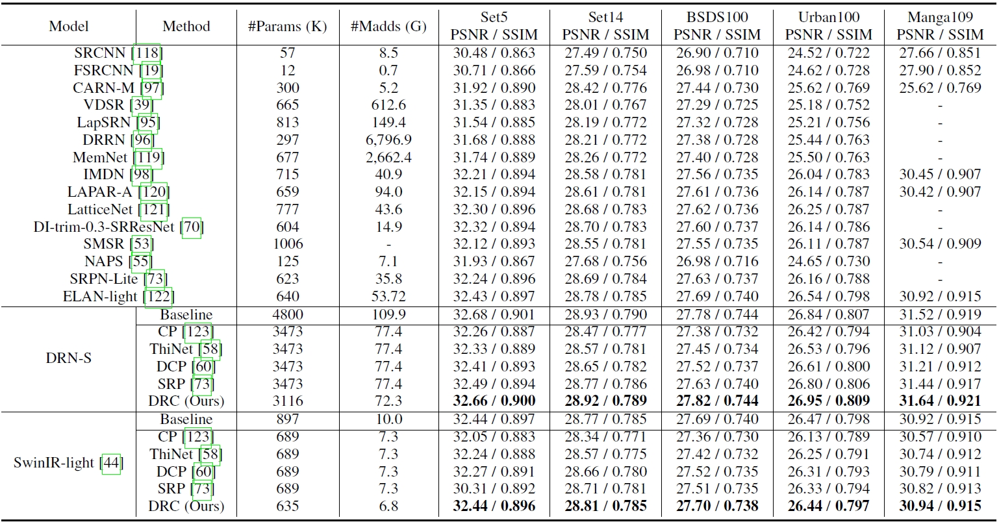
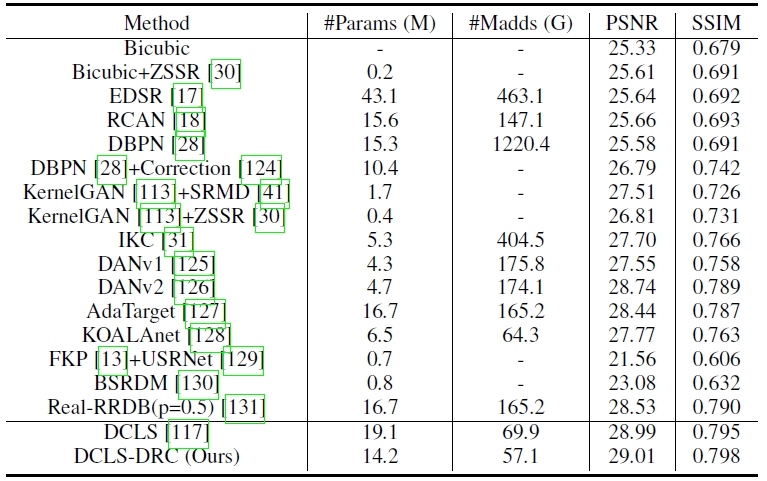
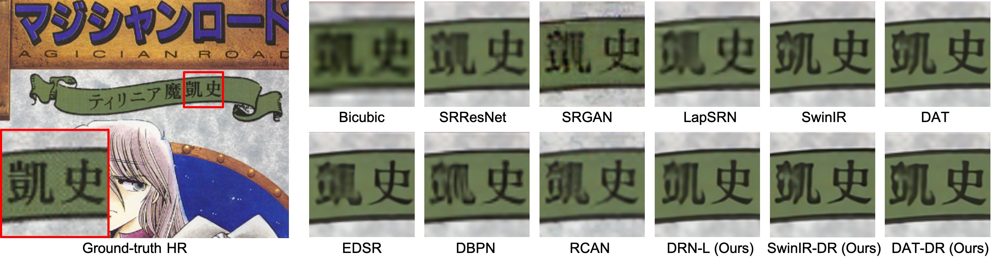
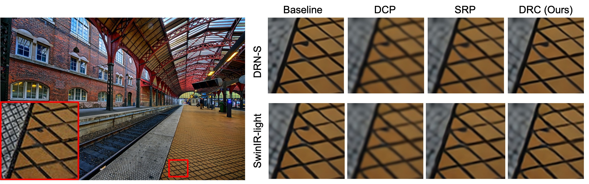

# Dual Regression Compression (DRC)

[Yong Guo](http://www.guoyongcs.com/), [Jingdong Wang](https://jingdongwang2017.github.io/), [Qi Chen](https://scholar.google.com/citations?hl=zh-CN&user=OgKU77kAAAAJ&view_op=list_works&sortby=pubdate), [Jiezhang Cao](https://www.jiezhangcao.com/), [Zeshuai Deng](https://scholar.google.com/citations?hl=zh-CN&user=udPURMAAAAAJ), [Yanwu Xu](https://scholar.google.com/citations?hl=zh-CN&user=0jP8f7sAAAAJ), Jian Chen, [Mingkui Tan](https://tanmingkui.github.io/)


This repository contains the official Pytorch implementation and the pretrained models of [Towards Lightweight Super-Resolution with Dual Regression Learning](https://arxiv.org/pdf/2207.07929.pdf).


---



## Contents
- [Dual Regression Compression (DRC)](#dual-regression-compression-drc)
  - [Contents](#contents)
  - [Dependencies](#dependencies)
  - [Datasets](#datasets)
  - [Models](#models)
  - [Training](#training)
      - [Train our DRN-S and DRN-L Models](#train-our-drn-s-and-drn-l-models)
      - [Train the SwinIR-DR Model](#train-the-swinir-dr-model)
      - [Train the DAT-DR Model](#train-the-dat-dr-model)
      - [Train the DCLS-DR Model](#train-the-dcls-dr-model)
  - [Model Compression](#model-compression)
      - [Model Compression for DRN-S](#model-compression-for-drn-s)
      - [Model Compression for SwinIR-light](#model-compression-for-swinir-light)
      - [Model Compression for DCLS](#model-compression-for-dcls)
  - [Testing](#testing)
      - [Testing of our DRN-S and Compressed DRN-S Models](#testing-of-our-drn-s-and-compressed-drn-s-models)
      - [Testing of the SwinIR-DR and SwinIR-light-DRC Models](#testing-of-the-swinir-dr-and-swinir-light-drc-models)
      - [Testing of the DAT-DR Model](#testing-of-the-dat-dr-model)
      - [Testing of the DCLS-DRC Model under the Blind Setting](#testing-of-the-dcls-drc-model-under-the-blind-setting)
  - [Results](#results)
  - [Citation](#citation)

## Dependencies
```shell
Python>=3.8, PyTorch>=1.10, numpy, skimage, imageio, matplotlib, tqdm
```

<!-- ## Catalog
- [x] Pre-trained models of some large SR models enhanced by our Dual Regression (DR)
- [x] Pre-trained models of the non-blind SR models compressed by our Dual Regression Compression (DRC)
- [x] Pre-trained models of the blind SR models compressed by our Dual Regression Compression (DRC)
- [x] Evaluation and Training Code -->


## Datasets


Used training and testing sets can be downloaded as follows:

| Training Set                                                 |                         Non-Blind Testing Set                          |                        Blind Testing Set                        |
| :----------------------------------------------------------- | :----------------------------------------------------------: | :----------------------------------------------------------: |
| [DIV2K](https://data.vision.ee.ethz.ch/cvl/DIV2K/) (800 training images, 100 validation images) +  [Flickr2K](https://cv.snu.ac.kr/research/EDSR/Flickr2K.tar) (2650 images) | You can evaluate our non-blind models on several widely used [benchmark datasets](https://cv.snu.ac.kr/research/EDSR/benchmark.tar), including Set5, Set14, B100, Urban100, Manga109. | You can evaluate our blind models on [DIV2KRK](https://www.wisdom.weizmann.ac.il/~vision/kernelgan/DIV2KRK_public.zip) dataset.|


## Models

You can download the pre-trained large SR models enhanced by our Dual Regression (DR) scheme. (**TODO**)

| Method    | Params | FLOPs (G) | Dataset  | PSNR (dB) |  SSIM  |                          Model Zoo                           |                       
| :-------- | :----: | :-------: | :------: | :-------: | :----: | :----------------------------------------------------------: |
| DRN-S     | 4.8M |  109.9    | Set5 |   32.68 | 0.901 | [Download]() |
| DRN-L     | 9.8M |  224.8    | Set5 |   32.74 | 0.902 | [Download]() |
| SwinIR-DR | 11.9M |  121.1   | Set5 |   33.03 | 0.904 | [Download]() |
| DAT-DR    | 14.8M  |   155.1   | Set5 |   33.17  | 0.906  | [Download]() |

You can download the compressed **non-blind** SR models (remove 30\% parameters) obtained by our Dual Regression Compression (DRC) approach.

| Method    | Params | FLOPs (G) | Dataset  | PSNR (dB) |  SSIM  |                          Model Zoo                           |                       
| :-------- | :----: | :-------: | :------: | :-------: | :----: | :----------------------------------------------------------: |
| DRN-S30     | 3.1M |  72.3    | Set5 |   32.66 | 0.900 | [Download]() |
| SwinIR-light-DRC     | 635K |  6.8    | Set5 |   32.44 | 0.896 | [Download]() |

You can download the compressed **blind** SR models (remove 30\% parameters) obtained by our DRC approach.

| Method    | Params | FLOPs (G) | Dataset  | PSNR (dB) |  SSIM  |                          Model Zoo                           |    
| :-------- | :----: | :-------: | :------: | :-------: | :----: | :----------------------------------------------------------: |
| DCLS-DRC | 14.2M |  57.1   | DIV2KRK |  29.01 | 0.798 | [Download]() |

## Evaluating Pre-trained Models

#### Testing of our DRN-S and Compressed DRN-S Models
You can use the following command to test our DRN-S model for 4x SR. To test the compressed DRN-S model, you may need to set the path of the channel configuration `--config_path` in the following commands.

```shell
cd DRN/

# Test DRN-S
python main.py --data_dir datasets/ \
--save ../experiments/drns_x4 \
--data_test Set5 --scale 4 --template DRNS \ 
--test_only --save_results \
--pre_train ../pretrained_models/DRNS4x.pt

# Test DRN-S30 (which removes about 30% parameters from DRN-S)
python main.py --data_dir datasets/ \
--save ../experiments/drns30_x4 \
--data_test Set5 --scale 4 --template DRNS \
--test_only --save_results \
--pre_train ../pretrained_models/DRNS30_4x.pt \ 
--config_path ../pretrained_models/DRNS30_4x_config.txt
```

#### Testing of the SwinIR-DR and SwinIR-light-DRC Models
You can use the following command to test the SwinIR-DR and SwinIR-light-DRC models for 4x SR.
**Note:** To test SwinIR-light-DR, you need to modify the option fileset to set `configs_path` to the path of the searched channel configuration for SwinIR-light model.

```shell
cd SwinIR/
# Test SwinIR-DR
python main_test_swinir.py --task classical_sr --scale 4 \
--training_patch_size 64 --folder_gt datasets/Set5/HR \
--folder_lq datasets/Set5/LR_bicubic/X4 \
--model_path ../pretrained_models/SwinIR/SwinIR-DR_x4.pth

# Test SwinIR-light-DR
python main_test_swinir.py --task lightweight_sr --scale 4 \
--folder_gt datasets/Set5/HR \
--folder_lq datasets/Set5/LR_bicubic/X4 \
--model_path ../pretrained_models/SwinIR/SwinIR_light_DRC.pth \
--opt_path options/swinir/test_swinir_sr_lightweight_pruning.json 
```

#### Testing of the DAT-DR Model
You can use the following command the test the DAT-DR Model.
**Note:** You need to modify the option file to set the paths of dataset and pretrained DAT-DR model.
```shell
cd DAT/
# Test DAT-DR
python basicsr/test.py -opt options/Test/test_DAT_x4_drn.yml
```


#### Testing of the DCLS-DRC Model under the Blind Setting
You can use the following command the test the DCLS-DRC Model. **Note:** You need to modify the option file to set the paths of dataset, pretrained DCLS-DRC model and the search channel configuration file.

```shell
cd DCLS/
# Test DCLS-DRC
python test.py \
-opt options/setting2/test/test_setting2_x4_dcls_drc.yml \
--save_dir experiments/test_dcls_drc_x4
```


---


## Training 
First, please download the training and testing datasets, and place them in any folder, such as `datasets/`. 

#### Train our DRN-S and DRN-L Models
You can use the following command to train the DRN-S or DRN-L model for 4x SR.

```shell
cd DRN/
# train DRN-S
python main.py --data_dir datasets/ --data_train DF2K \
--scale 4 --model DRN-S --save ../experiments/drns_x4

# train DRN-L
python main.py --data_dir datasets/ --data_train DF2K \
--scale 4 --template DRN-L --save ../experiments/drnl_x4
```

#### Train the SwinIR-DR Model
You can use the following command to train the SwinIR-DR model for 4x SR. Note that the path of the training and testing dataset in the configuration file may need to be changed. More details about the training code of SwinIR refer to [here](https://github.com/cszn/KAIR).

```shell
cd SwinIR/

# train SwinIR-DR
python -m torch.distributed.launch --nproc_per_node=4 --master_port=1234 \
main_train_psnr.py --opt options/swinir/train_swinir_sr_classical_drn.json --dist True

# train SwinIR-light-DR
python -m torch.distributed.launch --nproc_per_node=4 --master_port=1234 \
main_train_psnr.py --opt options/swinir/train_swinir_sr_lightweight_drn.json --dist True
```
  
#### Train the DAT-DR Model
You can use the following command to train the DAT-DR model for 4x SR. Note that the path of the training and testing dataset in the configuration file may need to be changed. More details about the training code of DAT refer to [here](https://github.com/zhengchen1999/DAT).

```shell
cd DAT/
python -m torch.distributed.launch --nproc_per_node=4 --master_port=1234 \
basicsr/train.py -opt options/Train/train_DAT_x4_drn.yml --launcher pytorch
```

#### Train the DCLS-DR Model
You can use the following command to train the DAT-DR model for 4x SR. More details about the training code of SwinIR refer to [here](https://github.com/megvii-research/DCLS-SR).
**Note 1:** The dependencies of DCLS is different from other parts of the code. You need to downgrade the verison of Pytorch using `pip install pytorch==1.6`.
**Note 2:** Please modify the configuration file to set dataroot, such as set `dataroot_GT` of training set to `datasets/DF2K/DF2K_HR`.


```bash
cd DCLS/codes/config/DCLS/
python3 -m torch.distributed.launch --nproc_per_node=4 --master_poer=4321 \
train.py -opt=options/setting2/train_setting2_drn_x4.yml --launcher pytorch
```


## Model Compression
In our DRC scheme, we first search for a promising channel configuration. Based on the searched channel configuration, we further prune the pre-trained SR model to obtain the compressed model.

#### Model Compression for DRN-S

- You can use the following command to **search** for a promising channel configuration for DRN-S.

```bash
cd DRN/
python main.py --search --scale 4 --template DRNS \
--pre_train pretrained_models/DRN/DRNS4x.pt \
--pre_train_dual pretrained_models/DRN/DRNS4x_dual_model.pt \
--epochs 100 --data_dir datasets/ --data_train DIV2KS \
--pruning_rate 0.3 --batch_size 16 --test_every 50 --save ../search_DRNS30/
```

- You can use the following command to **prune** the redundant channels of DRN-S. 
  **Note:** You may need to set `--configs_path` to the searched configuration file. For example, you can set `--configs_path ../pretrained_models/DRNS30_4x_config.txt`.

```bash
cd DRN/
python main.py --pruning --scale 4 --template DRNS \
--pre_train ../pretrained_models/DRN/DRNS4x.pt \
--pre_train_dual ../pretrained_models/DRN/DRNS4x_dual_model.pt \
--data_dir datasets/ --data_train DIV2KS \
--batch_size 16 --test_every 10 --save ../pruning_DRNS30/ \
--configs_path ../pretrained_models/DRNS30_4x_config.txt
```

- You can use the following command to **finetune** the compressed model. 
  **Note 1:** You may need to set `--pruned_model` to the path of the compressed DRN-S model. For example, you can set `--pruned_model ../pruning_DRNS30/model/pruned_model_cs_064.pth`.
  **Note 2:** You need to load the pretrained DRNL model during the finetune process using options `--pre_train`.

```bash
cd DRN/
python main.py --finetune --scale 4 --n_GPUs 4 \
--data_dir datasets/ --data_train DF2K \
--template DRNL --ft_model SDRN \
--configs_path ../pretrained_models/DRN/DRNS30_4x_config.txt \
--save ../prune_experiment/finetune_drns30_x4 \
--pre_train ../pretrained_models/DRN/DRNL4x.pt \
--pruned_model ../pruning_DRNS30/model/pruned_model_cs_064.pth \
--pruned_dual_model ../pretrained_models/DRNS4x_dual_model.pt 
```


#### Model Compression for SwinIR-light
- You can use the following command to **search** for a promising channel configuration for SwinIR-light. 
**Note:** You need to set the `pretrained_netG` in the option file to the path of the pretrained SwinIR-light-DR.


```bash
cd SwinIR/
python main_search_swinir.py \
--opt_path options/swinir/search_swinir_sr_lightweight_drn.json \
--save_dir ../experiments/search_swinir_light
```

- You can use the following command to **prune** the redundant channels of SwinIR-light.
**Note:** You need to set the `configs_path` in the option file to the searched channel configuration for SwinIR-light model.

```bash
cd SwinIR/
python main_pruning_swinir.py \
--opt_path options/swinir/pruning_swinir_sr_lightweight_drn.json \
--save_dir ../experiments/pruning_swinir_light
```

- You can use the following command to **finetune** the compressed model to obtain the final SwinIR-light-DRC. 
**Note 1:** You need to set the `configs_path` in the option file to the searched channel configuration for SwinIR-light.
**Note 2:** You need to set the `pretrained_netG` in the option file to the path of the pretrained SwinIR-light-DR model.
**Note 3:** You need to set the `xxx` in the option file to the path of the pretrained SwinIR-DR model. **(TODO)**

```bash
cd SwinIR/
python main_finetune_swinir.py \
--opt_path options/swinir/finetune_swinir_lightweight_drn.json \
--save_dir ../experiments/swinir_light_drc
```


#### Model Compression for DCLS

- You can use the following command to **search** for a promising channel configuration for DCLS. 
**Note:** You need to set the option `pretrain_model_G` in the option file to the path of the pretrained DCLS-DR model.

```bash
cd DCLS/
python search.py \
-opt options/setting2/train/search_setting2_x4_drn.yml \
--save_dir experiments/search_dcls/
```

- You can use the following command to **prune** the redundant channels of DCLS.
**Note:** You need to set the option `configs_path` to the path to the searched channel configuration file for DCLS.

```bash
cd DCLS/
python pruning.py \
-opt options/setting2/train/pruning_setting2_x4_drn.yml \
--save_dir experiments/pruning_dcls/
```

- You can use the following command to **finetune** the compressed model to obtain the final DCLS-DRC. (**TODO**)
**Note 1:** You need to set the option `configs_path` to the path to the searched channel configuration file for DCLS.
**Note 2:** You need to set the `pretrain_model_G ` in the option file to the path of the pretrained DCLS-DR model.

```bash
cd DCLS/
python finetune.py \
-opt options/setting2/train/finetune_setting2_x4_drn.yml \
--save_dir experiments/dcls_drc
```


## Results

We achieved competitive performance. Detailed results can be found in the paper.

<details>
<summary>Click to expand</summary>

- Comparison results with SOTA SR methods for 4x SR in Table 1.

<p align="center">
  
</p>


- Comparison results with lightweight SR methods for 4x SR in Table 2.

<p align="center">
  
</p>

- Comparison results with blind SR methods for 4x SR in Table 3

<p align="center">
  
</p>


- Visual comparison (x4) with SOTA methods for 4x SR.

<p align="center">
  
</p>

- Visual comparison (x4) with compression methods for 4x SR.

<p align="center">
  
</p>
</details>

---


## Citation
If you find this repository helpful, please consider citing:
```
@article{guo2022towards,
  title={Towards lightweight super-resolution with dual regression learning},
  author={Guo, Yong and Wang, Jingdong and Chen, Qi and Cao, Jiezhang and Deng, Zeshuai and Xu, Yanwu and Chen, Jian and Tan, Mingkui},
  journal={arXiv preprint arXiv:2207.07929},
  year={2022}
}
```